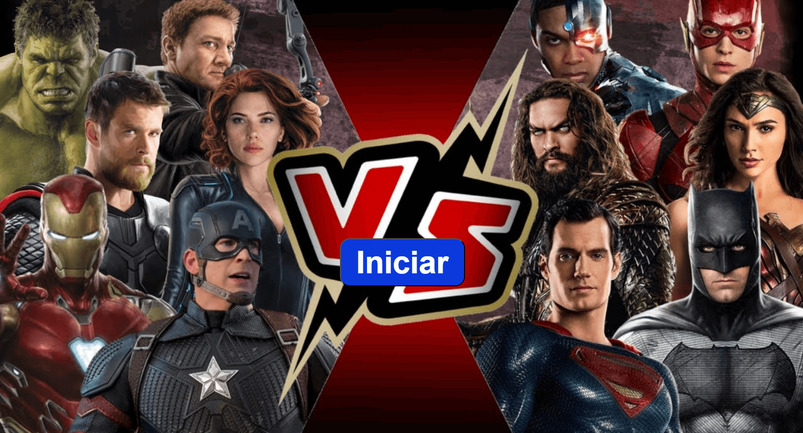

# Desafio Shark Tank - Versão 2

## Projeto: Quiz Marvel vs. DC

Este projeto foi desenvolvido como parte de um desafio "Shark Tank" de desenvolvimento web, onde o objetivo era criar e "vender" uma solução em apenas duas horas. Nossa equipe criou um site com um quiz divertido para diagnosticar se o usuário tem mais afinidade com o universo da Marvel ou da DC.

O quiz, composto por nove perguntas, analisa as respostas do usuário e o redireciona para uma página com uma roleta que gira e só depois mostra o universo com o qual ele mais se identifica.

---

### **Contexto do Projeto**

Este projeto foi desenvolvido como parte da disciplina de Desenvolvimento Web II, ministrada pelo **Prof. Dr. Bruno Zolotareff dos Santos.**

---

### **Tecnologias Utilizadas**

* **HTML:** Estrutura das páginas
* **CSS:** Estilização e layout
* **JavaScript:** Lógica do quiz e redirecionamento

---

### **Membros da Equipe**

* Clarice Ferreira Rocha Franco
* Daniel Felipe Ferreira
* Gabriel de Moura
* Guilherme dos Santos Silva
* Johnny da Silva Franco de Lima
* Vitor de Almeida Bernardo

---

### **Link do Projeto**

Você pode acessar o projeto final [aqui](https://desafio-shark-tank.vercel.app/).

---

### **Como Usar**

1.  Clone o repositório para sua máquina local.
2.  Abra o arquivo `index.html` em seu navegador.
3.  Responda às perguntas e descubra a qual time você pertence!